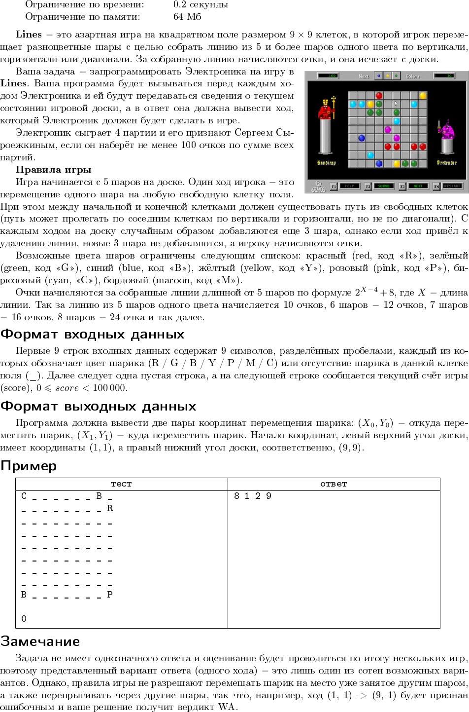

# Задача KhCup XV (2018)



## Что тут и где?

* lines-game-engine -- общая реализация игровой механики Lines, которая используется в lines-generator и lines-checker
* lines-checker -- проверяет ход на корректность
* lines-generator -- применяет ход пользовательского решения + генерирует новые шарики на поле
* lines-viewer -- Web-визуализация лога игры

## Как запустить партию?

Прежде чем запустить партию необходимо скомпилировать:

* Решение (например, `c++ solution.cpp -O3 -o solution` или `rustc -O solution.rs`)
* lines-generator (`cd lines-generator && cargo build`)
* lines-checker (`cd lines-checker && cargo build`)

Когда всё скомпилировано, можно запустить скрипт, который запишет лог игры в `/tmp/board.log`:

```
$ ./play.sh ./solution
```

## Как визуализировать партию?

Вставьте лог игры (`/tmp/board.log`) в lines-viewer (можно запустить свою версию
из соответствующей папки или воспользоваться https://khcup.qbit.org.ua/lines).

## Турнирная таблица решений на одной партии

* TOPMO3a (554 очка)
* AntiMorituri (394 очка)
* frol (34 очка)
* team7 (20 очков)
